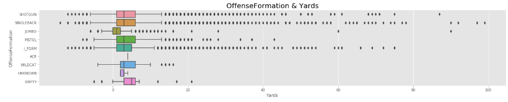
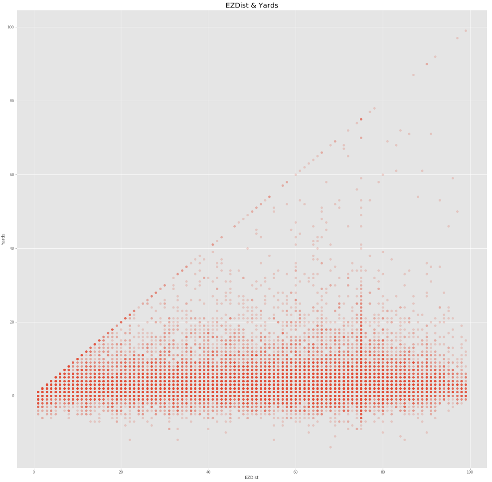
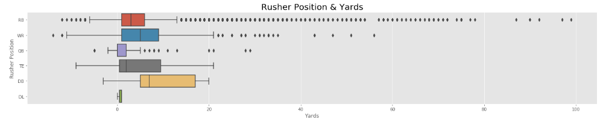

# NFL Big Data Bowl - Predictive Rushing Models
In the National Football League (NFL), roughly a third of teams’ offensive yardage comes from run plays. Ball carriers are generally assigned the most credit for these plays, but their teammates (by way of blocking), coach (by way of play call), and the opposing defense also play a critical role. Traditional metrics such as ‘yards per carry’ or ‘total rushing yards’ can be flawed; in this competition, the NFL aims to provide better context into what contributes to a successful run play.

# Contest Information

<a href="https://www.kaggle.com/c/nfl-big-data-bowl-2020/overview/evaluation">Evaluation (CRPS)</a>

<a href ="https://www.kaggle.com/c/nfl-big-data-bowl-2020/overview/code-requirements">Code Requirements</a>

# Data Set
<a href="https://www.kaggle.com/c/nfl-big-data-bowl-2020/data">train.csv</a>
 
# Exploratory Data Analysis (EDA) 

Several features do not have a standardized input methodology which results in atypical values that require cleansing. The primary issues are typos, strings instead of numbers, and different explanations for the same feature.
 
<UL>
<LI>WindSpeed Examples: "13, 13 MPH, E, 10-20, 15 gusts up to 25". 
<LI>GameWeather Examples: "N/A Indoor, N/A (Indoors), Controlled Climate, Indoors"
</UL>

These issues are particularly problematic in GameWeather, WindDirection, WindSpeed, StadiumType, Turf, and PlayerCollegeName. They are less problematic, but still present in Position, Stadium, TeamAbbreviations, etc. 

<a href="https://github.com/erikw425/NFL_Big_Data_Bowl_Rushing/blob/master/NFL_Rushing_EDA.ipynb">NFL Big Data Bowl - Rushing EDA.ipynb</a>

# Pre-Processing, Feature Engineering, and Data Visualizations

Based on time and code constraints, some features were fixed and others were dropped. Fixed features only had a few issues (ex: TeamAbbr: BLT, BAL) and dropped features had high cardinality (ex: GameWeather: N/A Indoor, N/A (Indoors), Indoor, Indoors, etc).

<a href="https://github.com/erikw425/NFL_Big_Data_Bowl_Rushing/blob/master/NFL_Rushing-PreProcessing-FeatureEngineering-DataVisualizations.ipynb	">NFL Big Data Bowl - Rushing PreProcessing, Feature Engineering, and Data Visualizations.ipynb</a>

# Data Visualization Examples

# Regressions

After preliminary regression analysis with mapping features (GameWeather -> Snow :1 Else :0, etc.), it was determined that many high cardinality features have negliglbe impact. 

# Predictive Rushing Model

Coming soon...
